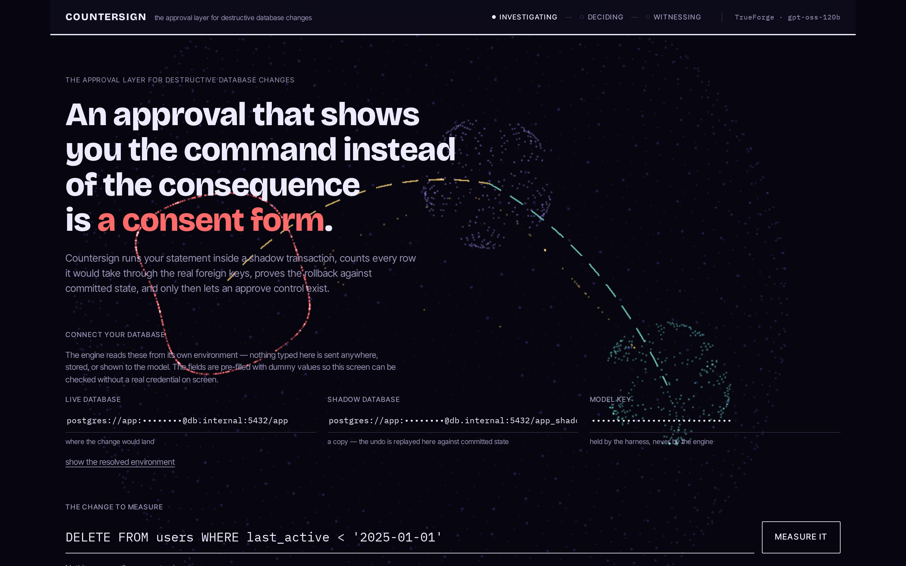
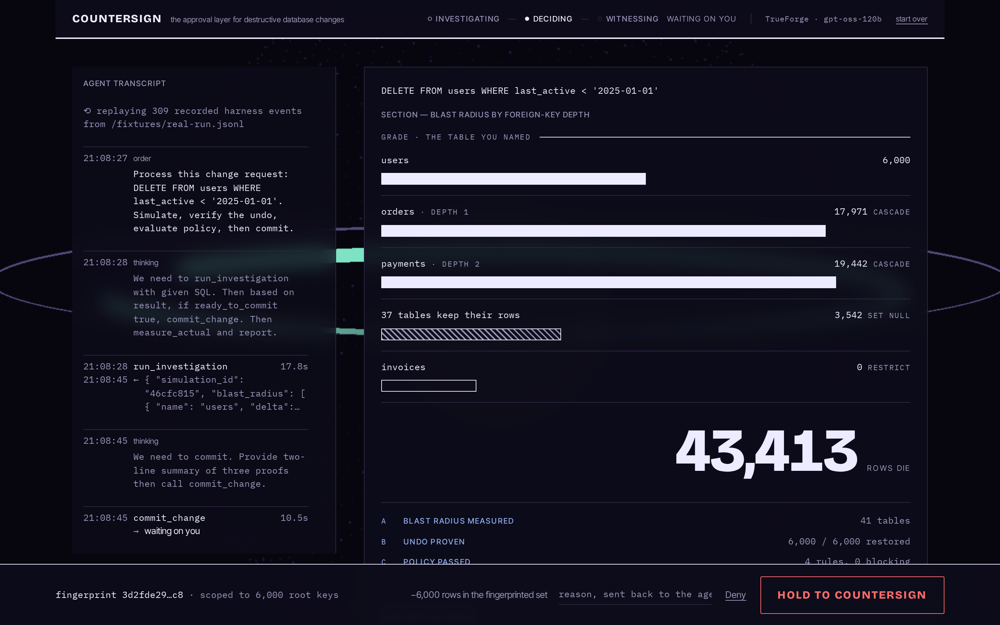
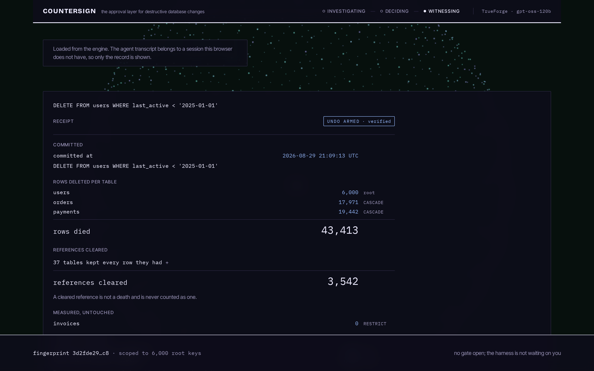
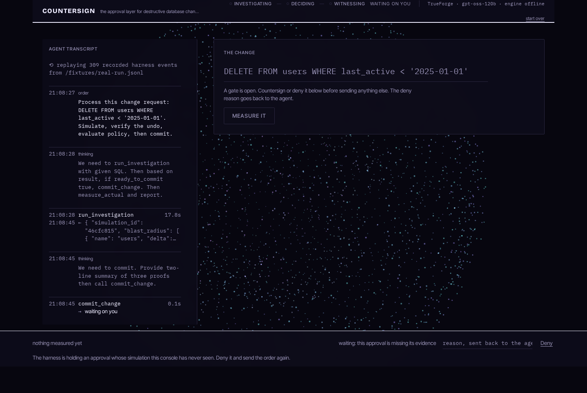

<div align="center">

# ⬢ COUNTERSIGN

**The approval layer for destructive database changes.**

*You approved six thousand rows. It took 43,413. The extra 37,413 were orders placed by
those users, and payments made against those orders, reached through foreign keys the
approval prompt never mentioned. Countersign will not render an approve button until it has
measured exactly what a change destroys and proven the rollback brings it back.*

Built on [TrueForge](https://github.com/truefoundry/trueforge) for
[The Agent Harness Hackathon](https://www.wemakedevs.org/hackathons/trueforge)
(WeMakeDevs × TrueFoundry × Qodo) · solo build · Aug 24–30, 2026

</div>

---

## The problem

Every agent harness ships human approval, and every one of them shows the human the same
thing: a tool name and some JSON.

> `commit_change {"table": "users", "where": "last_active < '2025-01-01'"}`, **Allow / Deny?**

Allow what, exactly? How many rows die? What cascades behind them? Can any of it be undone?
Nobody can answer that from the prompt, so the person clicking becomes the safety layer while
being given nothing to be safe with. That is not a control. It moves the blame.

## What Countersign does

A migration lands in a GitHub PR. The Countersign agent (running on TrueForge):

1. **Runs the statement for real**, inside `BEGIN … ROLLBACK` on the live database, and
   measures what it actually did through every foreign key the schema declares. Per table row
   counts, each edge labelled `CASCADE`, `SET NULL` or `RESTRICT`. Nothing here is a guess
   about what might happen.
2. **Writes the rollback** from snapshots of the rows before they change, then tests it like
   code: applies the change on a copy of the database, commits it, replays the rollback
   against that committed state, and checks the exact primary keys come back. If twelve of six
   thousand fail to return, that is a failure and it is reported as one.
3. **Checks it against your rules**, with a deterministic engine reading the measurement.
   How many rows may die, which tables must never lose any, whether a proven rollback is
   required. No model sits anywhere in that path. The agent proposes and only code approves.
4. Only then does TrueForge pause on the gated `commit_change`, and only then does the
   console's Approve control exist. Approval is a **fingerprint** (count + sha256 of the
   sorted PKs). The commit executes **scoped to that exact PK list**. Rows that started
   matching after measurement are *reported as drift and void the approval*, never
   silently destroyed.
5. After the commit: a **receipt** (predicted vs measured, posted back to the PR) and an
   **armed, verified undo**. Fire it and every approved row provably returns.

**We only delete what we can prove we can restore.**

## The console

| The landing | The gate |
|---|---|
|  |  |
| **The receipt** | **Refused** |
|  |  |

The blast radius is drawn as a section rather than tabulated. Depth down the page is foreign
key depth, bar length is how many rows, and the distinction the whole product turns on is
carried by fill pattern instead of a column header: solid means the rows are gone, hatching
means they survive with a foreign key set to null, and an unfilled boundary is a `RESTRICT`
edge that bounds the damage and takes nothing. Patterns rather than colours, so the drawing
still reads if you cannot tell the hues apart.

The approve control does not exist until the evidence earns it. It is not greyed out; it is
absent, and the bar says what is missing instead. When it does appear it is a hold, not a
click: 1200 milliseconds of sustained intent, with the same behaviour on `Enter`. If the
measurement expires while you are reading, the control withdraws rather than going grey,
because the drawing is still valid and the approval is not.

All six states, and how to reach each one, are in [docs/DEMO-STATES.md](docs/DEMO-STATES.md).

## Demo video

<!-- Replace this line with the video link before submitting. -->
**[Demo video →](ADD_LINK)**. About three minutes: an agent measures a destructive change,
the harness pauses, and the change commits only after a human countersigns it.

## Try it

**[Live demo →](https://countersign-xi.vercel.app)**. No keys, no setup, nothing to install.

The demo replays a recorded run of the real agent: the same event stream through the same
reducer, holding at the approval TrueForge actually raised. Press **Watch the recorded run**,
read the section, and hold the countersign control. It is not connected to a database, and it
says so on the page.

To run it against a database, including your own. See below.

## Run it

### Watch it without installing anything

**[countersign-xi.vercel.app](https://countersign-xi.vercel.app)** replays a recorded run of
the real agent. Nothing to set up, no keys, and you can hold the countersign control yourself.

### Run the replay locally
```bash
git clone https://github.com/itssaharsh/countersign && cd countersign
npm install
npm run dev -w console
```
Then open the recorded run (`gpt-oss-120b` on TrueForge, 309 harness events in
`console/public/fixtures/real-run.jsonl`):

```
http://localhost:5199/?replayEvents=/fixtures/real-run.jsonl&replay=/fixtures/state-investigating.json&replayAfter=/fixtures/state-witnessing.json
```

The stream runs through the same code a live session uses and stops where TrueForge actually
stopped, on `tool.approval_required`. Hold the control to release it: the engine state swaps
to the post commit snapshot of that same run and the receipt prints. The three files are one
artifact recorded in a single session, so they all name `simulation_id 46cfc815`; feed a single
one with `?replay=/fixtures/state-investigating.json` to see just that screen.

### Run it against a database (~15 min)

Local files, no accounts needed:

```bash
npm install
node db/seed.mjs && node db/seed.mjs --dir ./pglite-data/shadow   # a 41 table estate
node server/src/index.mjs                                          # the engine, :8977
SQLITE_PATH=./.trueforge/db.sqlite npx @truefoundry/trueforge@latest   # the harness, :8790
```

Or against managed Postgres, which is what the production shape looks like. Put two
connection strings in a gitignored `.env`, seed both, and the engine picks them up:

```bash
LIVE_DATABASE_URL=postgresql://…      # where the change would land
SHADOW_DATABASE_URL=postgresql://…    # a copy, where the rollback is proven

DATABASE_URL=$LIVE_DATABASE_URL   node db/seed.mjs --pg --reset
DATABASE_URL=$SHADOW_DATABASE_URL node db/seed.mjs --pg --reset
```

Expect it to be slower than local files: the same investigation took 17 seconds on local
PGlite and 71 against a managed database in another region, most of it replaying the rollback
across the network. Raise `VITE_FRESHNESS_SECONDS` if your operators need longer to read than
the signature lasts. [docs/ADOPT.md](docs/ADOPT.md) covers pointing it at your own estate, and
hosting it for other people.
Then in TrueForge (http://localhost:8790):
1. **Settings → Models**: add a provider. Two paths:
   - *Any provider from the catalog* (OpenAI/Anthropic/Gemini) with its API key, then `node agent/create-agent.mjs` with the model name set in `agent/spec.json`.
   - *Groq free tier via the key rotor* (what the demo used): put `GROQ_KEY_A`/`GROQ_KEY_B`/`GROQ_KEY_C` in a local `.env` (gitignored), run `node tools/key-rotor.mjs` (localhost:8991, fails over between keys, strips the `reasoning_content` echo Groq rejects), add a **custom** provider in TrueForge with base URL `http://127.0.0.1:8991/v1`, model id `openai/gpt-oss-120b`, name `gpt-oss-120b`, then `node agent/create-agent.mjs --real` (lean profile sized for an 8k-TPM tier).
2. **Settings → Connectors → Add MCP Server**: `http://127.0.0.1:8977/mcp`, name `countersign`
   (or launch TrueForge with `MCP_CATALOG_PATH=$PWD/catalog/mcp-catalog.yaml` for the one-click preset).
3. `node agent/create-agent.mjs [--real | --mock]`, creates the `countersign` agent (pins the API-only
   `require_approval_for_tools: ["commit_change","fire_undo"]`). `--mock` points it at `tools/mock-model.mjs`,
   a scripted zero-credit driver for rehearsals; the recorded demo runs the real model.
4. `npm run dev -w console` → http://localhost:5199 → transmit:
   *"Process this change request: DELETE FROM users WHERE last_active < '2025-01-01'"*
5. Watch the evidence board fill, the gate arm, and TrueForge pause. The decision is yours.

End-to-end scripted proof (pause → approve → commit → undo → restore): `node agent/e2e.mjs --approve`
Engine test suite (11 tests, every demo claim): `npm test -w server`

## How it uses TrueForge

| Harness capability | Where it's load-bearing |
|---|---|
| Custom MCP server | `server/`, shadow tx must span many statements on one connection; DB creds stay server-side |
| Tool annotations + approval | read tools `readOnlyHint`; `commit_change`/`fire_undo` `destructiveHint` + pinned by literal name via the **API-only** `require_approval_for_tools` |
| Pause/resume protocol | console captures `tool.approval_required` (via `sourceEventId`), resumes with `user.tool_approval` (deny reasons feed back to the agent) |
| SDK-native UI | the console speaks `createTurnStream` / `withMetadata` / delta-merging directly, the harness runs the loop; we render its truth |
| Skills | `skills/countersign-dossier`, git-backed SKILL.md; deterministic policy evaluator + dossier renderer for the sandbox path (dual-pathed in-server when sandbox is off) |
| Shipped MCP catalog | `github` (PR-sourced migrations in, receipts out) |
| Catalog overlays | `catalog/` + `MCP_CATALOG_PATH`/`SKILL_CATALOG_PATH` → countersign appears as a first-class preset in TrueForge's own settings UI |
| Subagents / persistence | dynamic subagents enabled; sessions survive reconnects (`subscribeToTurn`) |

## Honest scope

- v1 measures single-table `DELETE … WHERE` (full cascade + verified row undo) and
  `ALTER TABLE … ADD COLUMN` (reversible control case with auto down-migration).
- Fingerprints cover row content with volatile columns excluded (printed on the gauge).
  They do **not** cover grants, triggers, sequences, or non-row side effects.
- A failed undo is reported as **"NOT RESTORED BY THE GENERATED ROLLBACK"**: we prove
  our rollback failed, not that recovery is impossible.
- Your database's PITR is a time machine that costs every write since the mistake.
  Countersign is a scalpel: row-scoped, reviewable, in the PR, armed in milliseconds.
- Prior art: Bytebase/PlanetScale gate database *pipelines*. Countersign is the approval
  surface for *any* destructive agent action, the database is the first domain, not the product.

## Qodo Code Review Evidence

Every substantive change entered through a pull request reviewed by Qodo before merge.

**Representative merged PR: [#1, shadow-execution engine](https://github.com/itssaharsh/countersign/pull/1)**: Qodo surfaced 12 findings including a genuine High on the product's core promise: the drift fingerprint covered only root primary keys, so a cascade child added *after* measurement could be deleted without undo coverage. We rebuilt the fingerprint (root PK set + row-content hash + per-cascade-table probe queries re-run inside the commit transaction) and dismissed one finding in-thread with a fails-safe rationale (diamond cascade paths are caught by committed-state undo verification).

The full trail: [PR #1](https://github.com/itssaharsh/countersign/pull/1) · [PR #2](https://github.com/itssaharsh/countersign/pull/2) · [PR #3](https://github.com/itssaharsh/countersign/pull/3) show the initial reviews (26 findings, 22 High), per-finding outcomes posted in-thread, the fix batch, and Qodo's follow-up review striking resolved findings against the final code. The same loop ran on every later PR ([#6](https://github.com/itssaharsh/countersign/pull/6)–[#15](https://github.com/itssaharsh/countersign/pull/15)), and on the console rebuild ([#16](https://github.com/itssaharsh/countersign/pull/16)–[#18](https://github.com/itssaharsh/countersign/pull/18)). Triage table for all of them, PR #1 through PR #18: [docs/QODO-LOG.md](docs/QODO-LOG.md).

**The review that mattered most: [#18, the countersign gate](https://github.com/itssaharsh/countersign/pull/18).** Thirteen findings over five rounds on a single component, the hold-to-countersign control, the one piece of the product whose entire job is to be trustworthy. Four were correctness bugs that reached the branch:

| Finding | What would have happened |
| --- | --- |
| **Stale hold still approves** | A hold begun at t=119s landed the approval at t=120.2s, *after* the control had withdrawn for staleness, an irreversible commit authorised on evidence the console had already rejected. The exact failure Countersign exists to prevent, inside the control built to prevent it. |
| **Completed hold blocks later gates** | Completion state was never reset, and one gate bar serves every gate in a session. After countersigning the commit, the undo's `RESTORE` control would have rendered permanently labelled `COUNTERSIGNED` and refused to start. |
| **Focus loss preserves hold** | The hold was cancelled by keyup or *window* blur, and window blur does not fire when focus merely moves elsewhere on the page. Tabbing away mid-hold left the timer running and the approval landed after the sustained intent had ended, defeating the point of a hold. |
| **Declined answer crosses questions** | An approval and a question can be pending at once; a single coalesced identity key stayed pinned to the approval, so a later question arrived prefilled with a previous question's text and would have sent an answer meant for a different tool call. |

Two of those were reachable only because **two of our own assertions passed by measuring the absence of a different bug.** The REFUSED-state check asserted that the gate bar did not overlap the dock and that the control was absent; both were true while the refusal text was squeezed into a narrow column beside the inputs, so a broken layout read as verified. And the first stale-hold regression test reported a failure that was not one, it started the hold with three seconds left, where completing before expiry is correct, which is its own lesson: a test that can only pass is worth as little as one that can only fail.

Two later findings are worth naming beside those, because they are the same lesson pointed at
different targets.

**A misclassification that inverted a meaning.** The ledger's helpers separated "rows that die"
from "rows that survive with a reference cleared" by counts alone, zero `delta`, some
`affected`. The engine gives *every* non-CASCADE terminal edge that shape, `RESTRICT`
included. So a `RESTRICT` edge with rows behind it would have been counted as references
cleared, when it clears nothing at all: it blocks the delete outright. The distinction the
ledger exists to preserve was being computed by a rule that could not see it. Nothing on any
shipped fixture changed, because `invoices` has no rows in the demo's blast path, which is
exactly why it survived review until someone asked what the rule would do with an edge it had
never been given.

**A check that compared two runs which both rendered nothing, and reported PASS.** Proving the
fix above needed a fixture with a blocking `RESTRICT` edge, which does not exist, so the test
injected one and compared the before and after. Both runs rendered no ledger group at all,
the injection had broken the page load, and "unchanged" was therefore trivially true. The
check passed while measuring absolutely nothing.

That is the fifth instance in this project of the same failure: **something reporting success
while being useless.** The others were TrueForge answering `200` on `/api/v1/agents` with no
model providers configured, so every agent creation failed; Playwright's `networkidle` never
firing because a proxied request to a dead service hangs open rather than failing; two
assertions that passed by measuring the absence of a *different* bug than the one they named;
and a contrast helper that mis-parsed `color(srgb …)` floats as 0–255 and cheerfully reported
black text at 1.12:1.

The rule that came out of it is in [DECISIONS.md](DECISIONS.md): **assert capability, never
response.** A health check that proves a service is listening proves nothing; ask it to do the
thing. And every check should carry a mutation that makes it fail, the guard on the ledger
test now refuses to run at all unless its baseline renders a real group.

The pattern across all thirteen is the same. Every finding lived in a state the local tests never entered: expiry landing mid-hold, focus leaving mid-hold, a second gate after the first, an approval and a question together, reduced motion. The control's whole purpose is the unhappy path, and it was being tested on the happy one. Full round-by-round record, including the findings dismissed with reasons and one repeat finding that was wrongly dismissed as stale before being fixed properly: [PR #18](https://github.com/itssaharsh/countersign/pull/18).

## A finding about our own policy engine

The policy engine ships four deterministic rules. While verifying that every screen in the
demo is reachable against the seeded database, **two of them turned out to be unreachable**,
for two different reasons, one fixable and one not.

`invoices` and `audit_log` were **created and indexed by the schema but never populated**.
Every `protected_tables` check therefore compared against empty tables, and the only
`RESTRICT` edge in the estate had no rows behind it. Two of four rules could not fire, and
nothing in the test suite noticed, because each rule was tested against inputs rather than
against the seeded estate.

`protected_tables` is now reachable: `audit_log` carries rows, and a statement aimed at it
fails the rule.

```
DELETE FROM audit_log WHERE subject_table = 'users'
  2,400 rows · FAIL protected_tables, deletes rows in protected: audit_log
```

`restrict_edges_block` is **unreachable by construction, not by seeding.** The
engine measures a change by executing it inside `BEGIN … ROLLBACK`. Any statement whose blast
path reaches a `RESTRICT` edge with rows behind it aborts on the foreign key *before* policy
is ever evaluated, so the run ends with the database's own error rather than a `FAIL` verdict:

```
update or delete on table "orders" violates RESTRICT setting of
foreign key constraint "invoices_order_id_fkey" on table "invoices"
```

That is a safe outcome, the change is refused either way, and the operator is told why, but
it means the rule is **redundant with the database's own enforcement** rather than an
independent check, and `POLICY PASSED · 4 rules, 0 blocking` overstates how many of them can
ever be evaluated. No seeding fixes this; only measuring without executing would, and
measuring by executing is the whole thesis. **Documented rather than removed**, because
deleting it would hide the fact that the count was ever misleading.

The seeded estate now populates both tables, so the console's note about the `RESTRICT` edge
is a true statement about a table with rows instead of a statement about an empty one. The
invoices are deliberately attached to a reserved band of orders that no demo statement
touches, because attaching them anywhere else aborts the demo's own change.

## Colophon

Built with AI coding assistance (Claude Code). Every architectural decision, and every
claim made here, is reviewed and explainable by the author, the reasoning behind each one
is written up in [docs/EXPLAIN.md](docs/EXPLAIN.md).

## License

MIT © 2026 Saharsh Tibrewala
