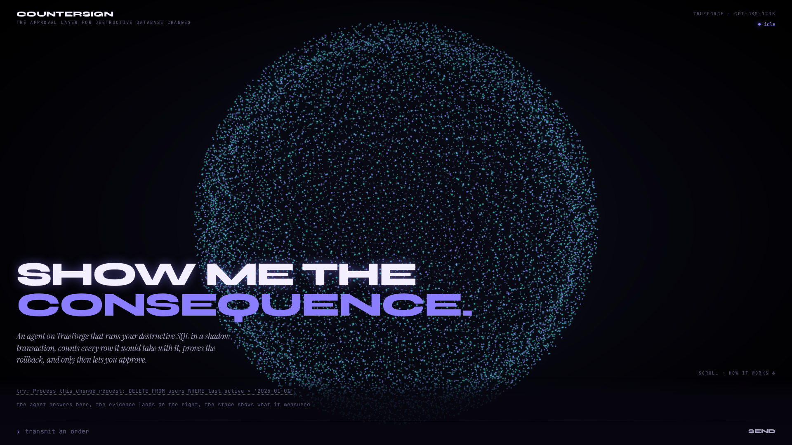
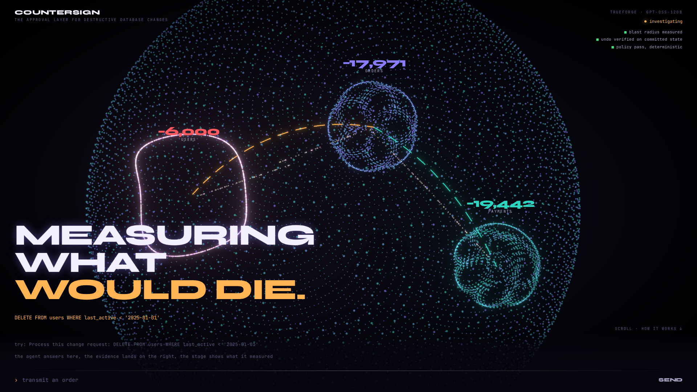
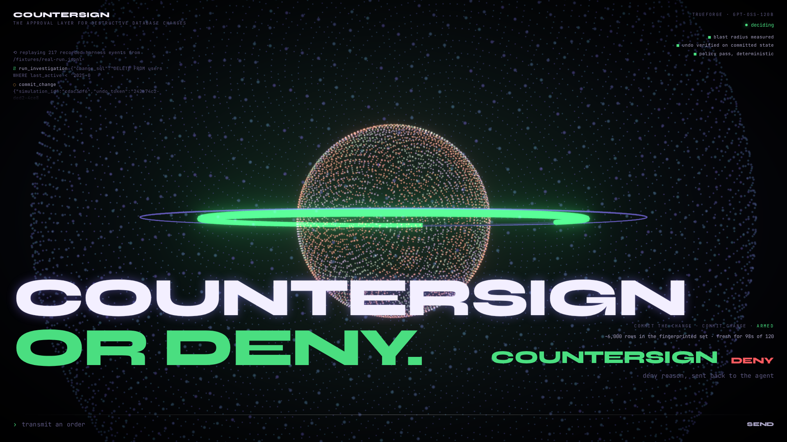
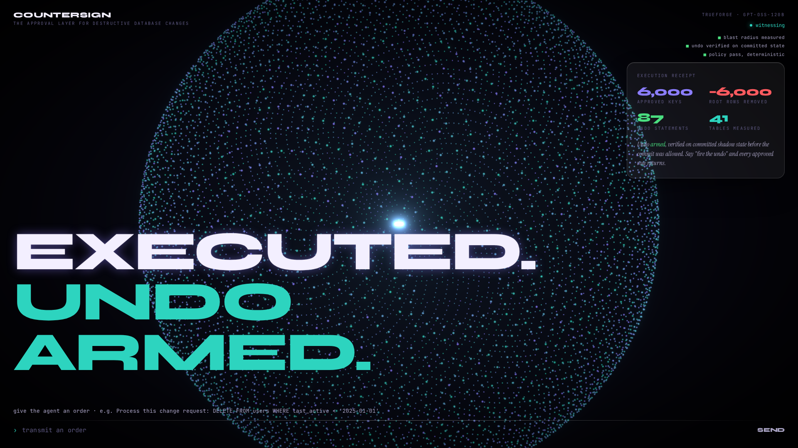
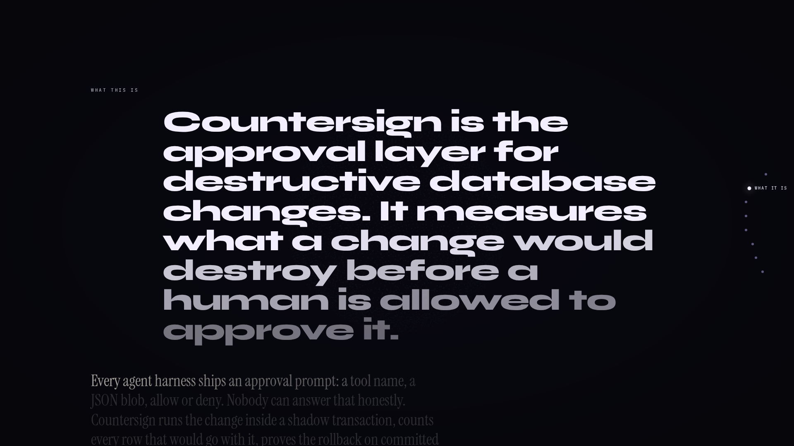
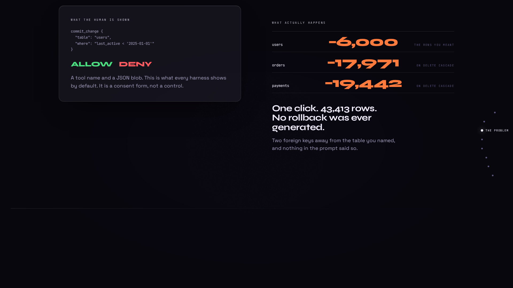
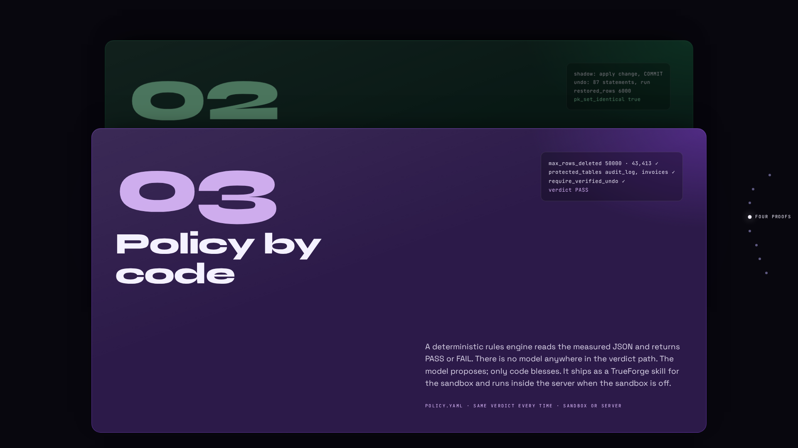
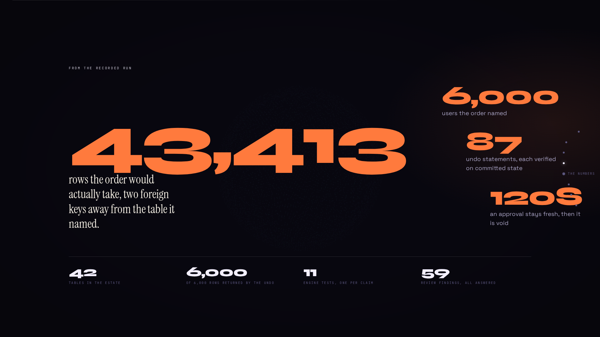

<div align="center">

# ⬢ COUNTERSIGN

**The approval layer for destructive database changes.**

*An approval gate that shows you the command instead of the consequence is not a safety
control — it's a consent form. Countersign refuses to render an Approve button until the
agent has measured exactly what a change destroys and proven the rollback restores it.*

Built on [TrueForge](https://github.com/truefoundry/trueforge) for
[The Agent Harness Hackathon](https://www.wemakedevs.org/hackathons/trueforge)
(WeMakeDevs × TrueFoundry × Qodo) · solo build · Aug 24–30, 2026

</div>

---

## The problem

Every agent harness ships human approval. The human sees a tool name and raw JSON:

> `commit_change {"table": "users", "where": "last_active < '2025-01-01'"}` — **Allow / Deny?**

Allow *what*, exactly? How many rows die? What cascades? Can it be undone? The safety
layer is a person guessing. That is not control — it is liability transfer.

## What Countersign does

A migration lands in a GitHub PR. The Countersign agent (running on TrueForge):

1. **Shadow-executes** the statement inside `BEGIN … ROLLBACK` on the live database and
   **measures** the true blast radius through every real foreign key — per-table row
   deltas, each edge labeled `CASCADE` / `SET NULL` / `RESTRICT`. Measured, not estimated.
2. **Generates the undo** from pre-image snapshots — then **proves it**: applies the
   change on a shadow database, **commits it**, replays the undo against that committed
   state, and asserts the exact primary-key set returns. A real test with a real failure mode.
3. **Evaluates policy deterministically** — a rules engine over measured JSON. No LLM
   anywhere in the verdict path. *The model proposes; only code blesses.*
4. Only then does TrueForge pause on the gated `commit_change` — and only then does the
   console's Approve control exist. Approval is a **fingerprint** (count + sha256 of the
   sorted PKs). The commit executes **scoped to that exact PK list** — rows that started
   matching after measurement are *reported as drift and void the approval*, never
   silently destroyed.
5. After the commit: a **receipt** (predicted vs measured, posted back to the PR) and an
   **armed, verified undo** — fire it and every approved row provably returns.

**We only delete what we can prove we can restore.**

## The console

| IDLE | INVESTIGATING | DECIDING | WITNESSING |
|---|---|---|---|
|  |  |  |  |

*Real-model run (Groq-hosted `openai/gpt-oss-120b`): the agent investigated, TrueForge paused on the gated commit, the operator countersigned, and the scoped commit executed — [gate](docs/screenshots/real-model-deciding.png) · [ledger](docs/screenshots/real-model-witnessing.png).*

The stage is the live console (drag the galaxy when idle, transmit an order, countersign at
the gate). Scroll down and the page becomes the story: the problem, the four proofs as stacked
tiles with the real evidence, the numbers from the recorded run, how TrueForge is
load-bearing, the review trail, and how to run it.

| what it is | the problem | four proofs | the numbers |
|---|---|---|---|
|  |  |  |  |

The UI is a *window* onto the gate, not the gate itself: `commit_change` refuses
server-side without a verified-undo token, a policy PASS, and a still-fresh fingerprint;
bypassing the button changes nothing.

## Run it

### Zero-key replay (fastest — judge mode)
```bash
git clone https://github.com/itssaharsh/countersign && cd countersign
npm install
npm run dev -w console
```
Then open the recorded real-model run (gpt-oss-120b on TrueForge, 217 harness events,
`console/public/fixtures/real-run.jsonl`):

```
http://localhost:5199/?replayEvents=/fixtures/real-run.jsonl&replay=/fixtures/state-investigating.json&replayAfter=/fixtures/state-witnessing.json
```

The stream is fed through the same SDK reducer the live console uses and **holds at the
gate exactly where TrueForge paused** (`tool.approval_required`). Click **Countersign** to
release it: engine state switches to the post-commit snapshot of the same run and the
receipt lands. `state-*.json` are `/state` snapshots keyed to that recording
(`simulation_id cdac3df6`); single scenes: `?replay=/fixtures/state-investigating.json`
or `?replay=/fixtures/state-witnessing.json`.

### Full live setup (~15 min)
```bash
npm install
node db/seed.mjs && node db/seed.mjs --dir ./pglite-data/shadow   # deterministic 42-table estate
node server/src/index.mjs                                          # countersign MCP server :8977
npx @truefoundry/trueforge@latest                                  # TrueForge :8790
```
Then in TrueForge (http://localhost:8790):
1. **Settings → Models** — add a provider. Two paths:
   - *Any provider from the catalog* (OpenAI/Anthropic/Gemini) with its API key, then `node agent/create-agent.mjs` with the model name set in `agent/spec.json`.
   - *Groq free tier via the key rotor* (what the demo used): put `GROQ_KEY_A`/`GROQ_KEY_B`/`GROQ_KEY_C` in a local `.env` (gitignored), run `node tools/key-rotor.mjs` (localhost:8991 — fails over between keys, strips the `reasoning_content` echo Groq rejects), add a **custom** provider in TrueForge with base URL `http://127.0.0.1:8991/v1`, model id `openai/gpt-oss-120b`, name `gpt-oss-120b`, then `node agent/create-agent.mjs --real` (lean profile sized for an 8k-TPM tier).
2. **Settings → Connectors → Add MCP Server** — `http://127.0.0.1:8977/mcp`, name `countersign`
   (or launch TrueForge with `MCP_CATALOG_PATH=$PWD/catalog/mcp-catalog.yaml` for the one-click preset).
3. `node agent/create-agent.mjs [--real | --mock]` — creates the `countersign` agent (pins the API-only
   `require_approval_for_tools: ["commit_change","fire_undo"]`). `--mock` points it at `tools/mock-model.mjs`,
   a scripted zero-credit driver for rehearsals; the recorded demo runs the real model.
4. `npm run dev -w console` → http://localhost:5199 → transmit:
   *"Process this change request: DELETE FROM users WHERE last_active < '2025-01-01'"*
5. Watch the evidence board fill, the gate arm, and TrueForge pause. The decision is yours.

End-to-end scripted proof (pause → approve → commit → undo → restore): `node agent/e2e.mjs --approve`
Engine test suite (11 tests, every demo claim): `npm test -w server`

## How it uses TrueForge

| Harness capability | Where it's load-bearing |
|---|---|
| Custom MCP server | `server/` — shadow tx must span many statements on one connection; DB creds stay server-side |
| Tool annotations + approval | read tools `readOnlyHint`; `commit_change`/`fire_undo` `destructiveHint` + pinned by literal name via the **API-only** `require_approval_for_tools` |
| Pause/resume protocol | console captures `tool.approval_required` (via `sourceEventId`), resumes with `user.tool_approval` (deny reasons feed back to the agent) |
| SDK-native UI | the console speaks `createTurnStream` / `withMetadata` / delta-merging directly — the harness runs the loop; we render its truth |
| Skills | `skills/countersign-dossier` — git-backed SKILL.md; deterministic policy evaluator + dossier renderer for the sandbox path (dual-pathed in-server when sandbox is off) |
| Shipped MCP catalog | `github` (PR-sourced migrations in, receipts out) |
| Catalog overlays | `catalog/` + `MCP_CATALOG_PATH`/`SKILL_CATALOG_PATH` → countersign appears as a first-class preset in TrueForge's own settings UI |
| Subagents / persistence | dynamic subagents enabled; sessions survive reconnects (`subscribeToTurn`) |

## Honest scope

- v1 measures single-table `DELETE … WHERE` (full cascade + verified row undo) and
  `ALTER TABLE … ADD COLUMN` (reversible control case with auto down-migration).
- Fingerprints cover row content with volatile columns excluded (printed on the gauge).
  They do **not** cover grants, triggers, sequences, or non-row side effects.
- A failed undo is reported as **"NOT RESTORED BY THE GENERATED ROLLBACK"** — we prove
  our rollback failed, not that recovery is impossible.
- Your database's PITR is a time machine that costs every write since the mistake.
  Countersign is a scalpel: row-scoped, reviewable, in the PR, armed in milliseconds.
- Prior art: Bytebase/PlanetScale gate database *pipelines*. Countersign is the approval
  surface for *any* destructive agent action — the database is the first domain, not the product.

## Qodo Code Review Evidence

Every substantive change entered through a pull request reviewed by Qodo before merge.

**Representative merged PR: [#1 — shadow-execution engine](https://github.com/itssaharsh/countersign/pull/1)** — Qodo surfaced 12 findings including a genuine High on the product's core promise: the drift fingerprint covered only root primary keys, so a cascade child added *after* measurement could be deleted without undo coverage. We rebuilt the fingerprint (root PK set + row-content hash + per-cascade-table probe queries re-run inside the commit transaction) and dismissed one finding in-thread with a fails-safe rationale (diamond cascade paths are caught by committed-state undo verification).

The full trail: [PR #1](https://github.com/itssaharsh/countersign/pull/1) · [PR #2](https://github.com/itssaharsh/countersign/pull/2) · [PR #3](https://github.com/itssaharsh/countersign/pull/3) show the initial reviews (26 findings, 22 High), per-finding outcomes posted in-thread, the fix batch, and Qodo's follow-up review striking resolved findings against the final code. The same loop ran on every later PR ([#6](https://github.com/itssaharsh/countersign/pull/6)–[#12](https://github.com/itssaharsh/countersign/pull/12): 33 more findings, each fixed or dismissed with a reason in-thread). Triage table for all of them: [docs/QODO-LOG.md](docs/QODO-LOG.md).

## AI Assistance Disclosure

Built with heavy AI coding assistance (Claude Code, Anthropic). All architecture
decisions, code, and claims were reviewed and are understood by the participant —
see [docs/EXPLAIN.md](docs/EXPLAIN.md) for the decision-by-decision briefing.

## License

MIT © 2026 Saharsh Tibrewala
